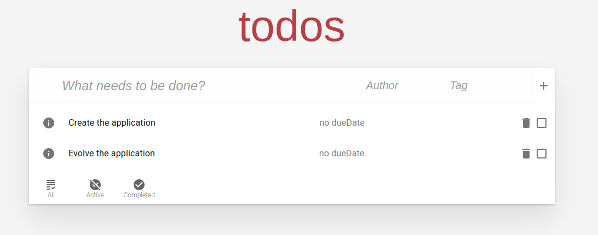
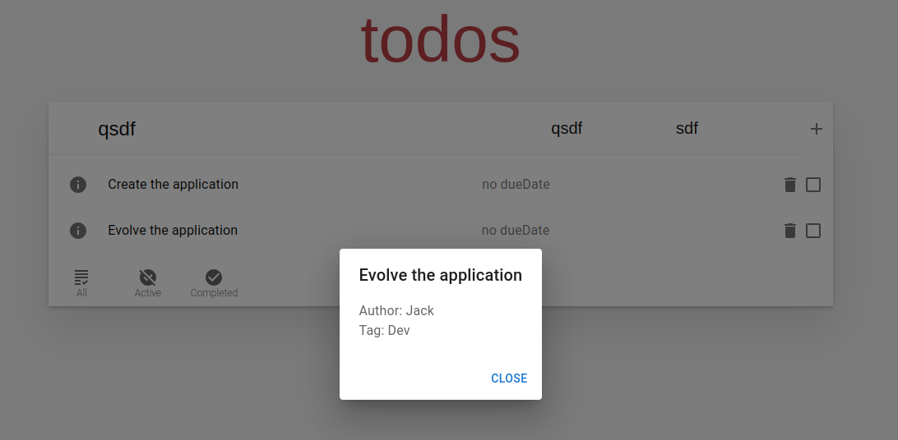

# Experiment Statement

Each one of the participants will have a slightly different experiment, but everyone will implement using both approaches.

## Experiment Prerequisites

If you have done the tutorial, this should be straightforward, as the requirements are exactly the same.

The two easiest ways are either **remotely**, in a GitHub CodeSpace via this [link](https://github.com/codespaces/new?template_repository=CharlyReux/evolvable-by-design-todomvc-frontend), with it, you will be able to start instantly (It is free, unless you go over 60 hours of runtime). Or **locally**, by using a Dev Container (you will need Docker, VS Code and the extension `ms-vscode-remote.remote-containers`). In either case, it should take a little bit of time to set up your environment.
#### Using a Dev Container
If using a Dev Container, in VS Code, you will first have to press F1 and run `Dev Containers: Clone Repository in Container Volume`  
Enter the repository name `CharlyReux/evolvable-by-design-todomvc-frontend`  
The repository should load, and you are ready to go.


## Getting Started

The app you will be working on is a simple todo app. 

The objective is to have an app that will look like this.  


Upon clicking on the information button of the individual todos, you have access to the details of that todo.   


An initial skeleton of the app is already provided, all you will have to do is to fill in some methods and replace some comments in specific places.

### Details
The app is composed of multiple parts, with the most important ones being:
- Components
  - TodoListPage: contains the main application
  - TodoList: contains the list of todos
  - DetailDialog: contains the dialog component displaying the author and tag information of a todo
- Service
  - TodoService: contains the methods used to call the backend

You will mainly have to modify the TodoService, and slightly the TodoListPage and the TodoList.  
> [!WARNING] 
> the TodoService needs to be implemented in a functional manner, each method must return the full list of todos.

### Procedure
There are two sets of 5 evolutions, you will start by making the front-end implementation either with the Classical approach or the Pivo approach, and then apply each set of evolutions consecutively. One done you will do the same with the other approach.

When you are ready run the command:
```sh
TODO make the script that create a branch and checks out the back
```


#### 1. Classical implementation
TODO add specification about the script that has to be run

To make things easier, you can check the swagger UI while coding(TODO specify how to access it) or the openApi specification directly(TODO provide the access to the file)  

1. First implementation
   1. Instantiate the service in the todolistpage
   2. Implement the methods in the TodoService
   3. Once done, run the following command: TODO `Add the command form the script` 
2. Add a required `dueDate` body parameter of type string to POST /todo.
3. Move `dueDate` attributes of Todo inside a new element `infos`.
   1. The easier way is to modify the todoService to modify the content of the todo back to its original form.
4. Move the `completed` element inside the existing `infos`
   1. The fix is similar to the previous one.
5. Completely Remove the `dueDate` return value from the infos response.
6. move the location of the id parameter from the path to the query in the GET tag method 


#### 2. Pivo implementation
TODO add spec about the pivo implementation
TODO add specification about the script that has to be ran

1. First implementation
   1. Instantiate the service in the TodolistPage(You will have to modify The todoService and the TodoList component, you can get inspiration from the [tutorial](https://github.com/CharlyReux/evolvable-by-design-tutorial/blob/main/tutorial.md#setting-up-pivo-in-our-application) we did earlier)
   2. Modify the TodoList component to use semantic data(You can use the utility component `with-semantic-data-required.jsx`)
   3. Implement the methods in the TodoService (you will have to modify the switchTodoStatus method as well)
   4. Once done, run the following command: TODO `Add the command for the script` 
2. Renamed GET /todos into GET /todo
3. Renamed `title` into `text` in the todo creation POST method
4. combine method GET `/todo/{todoId}/author` and GET `/todo/{todoId}/tag` to GET `/todo/{todoId}/details`
5. Change PUT /todo/{todoId} into POST /todo/{todoId}
6. To delete a todo, first complete it and then run delete, before it was possible to delete right away.
   1. For this evolution, you will have to change the todoList component to display the "deleteMany" button only when the filter is set to "completed"


